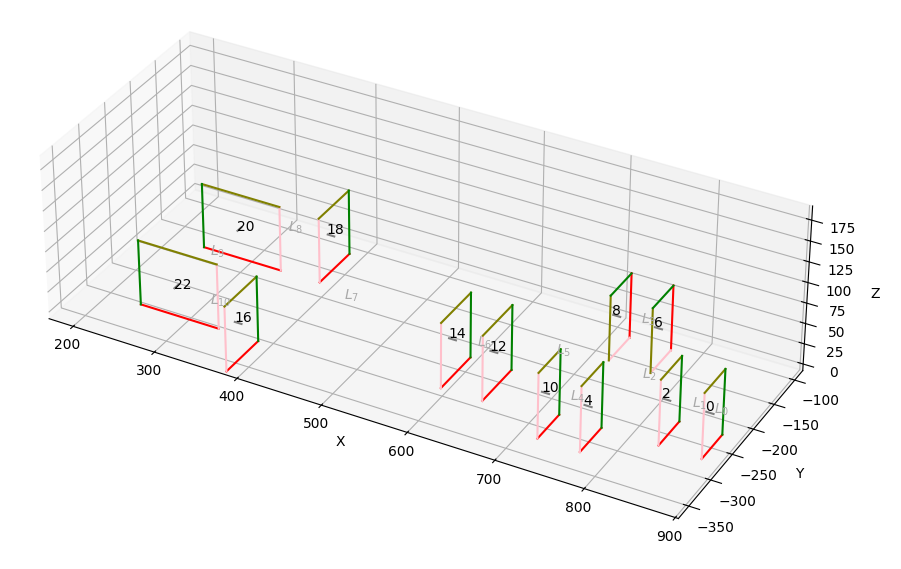

# vis.py

This is tool computes a potentially visible set (PVS) for a Quake map. It converts a portal file (PRT) to a leaf-to-leaf visibility matrix that is written to a map BSP file. It needs [other map tools](http://ericwa.github.io/ericw-tools/) to work.

I've written a detailed explanation of the algorithm in the [*Demystifying the PVS*](https://30fps.net/pages/pvs-portals-and-quake/) series on my blog.


*The rectangular portals of a simple example map.*

Since this is single-threaded Python code, it runs very slowly :) 

## Structure

The main algorithm is in the `vis.py` file. 3D clipping calculations and separating plane selection are in `clipper.py`. Input and output are handled in `prt_format.py` and `bsp_format.py`, respectively.

## Installation

```
pip install -r requirements.txt
```

The only real dependency is NumPy. Matplotlib is used for 3D visualization but can be omitted with the `--noviz` commandline flag.

Tested with Python 3.9.9.

## Usage

```
python vis.py data/example.prt data/example.bsp output.bsp
```

## Credits

This code is a Python reimplementation of the algorithms in [the original `vis` tool](https://github.com/ericwa/ericw-tools/blob/a6c7a18cb85cef64948d46780d4fc1bb3d1f575b/vis/) and [the updated version in ericw-tools](https://github.com/ericwa/ericw-tools/blob/a6c7a18cb85cef64948d46780d4fc1bb3d1f575b/vis/).

Some Quake BSP utilities adapted from Matthew Earl's [pyquake](https://github.com/matthewearl/pyquake) library.

License: [MIT No Attribution (MIT-0)](https://en.wikipedia.org/wiki/MIT_License#MIT_No_Attribution_License).